# Enterprise-Hybrid-Network-System-Infrastructure-Lab
Enterprise Hybrid Network &amp; System Infrastructure Lab
This project is dedicated to building a comprehensive, isolated corporate network and system infrastructure based on **VMware ESXi** virtualization, **MikroTik RouterOS** routing, and **Windows Server** based directory and security services (Active Directory, NPS/RADIUS, DNS, KMS).

The goal of the laboratory work is to implement and validate a fault-tolerant routing architecture (OSPF), secure segmentation (VLAN), centralized access control (AAA/RADIUS), and remote connection technologies (WireGuard, L2TP/IPSec VPN).

---
## 🗺️ Network topology

Below is a logical diagram of the built infrastructure, which includes three MikroTik routers (two physical/CHR and one virtual inside ESXi), domain services, and client access segments:

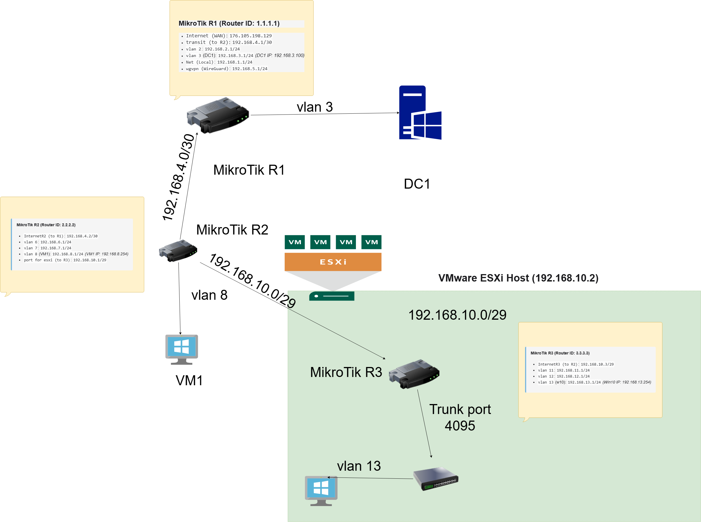

---

## 🛠️ Technology stack

* **Virtualization Hypervisor:** VMware ESXi 7.0 Update 3
* **Routing and Switching:** MikroTik RouterOS v7.21.2 CHR (R1, R2, R3)
* **Dynamic Routing Protocol:** OSPFv2 (Single Area)
* **Network Segmentation:** IEEE 802.1Q (VLAN Trunking, Bridge VLAN Filtering)
* **Directory Services:** Active Directory Domain Services (Domain: `AmazonLeo.local`)
* **Security and AAA Services:** Windows Server Network Policy Server (NPS) / RADIUS, Active Directory Users and Computers (ADUC)
* **Network Services:** DNS (A, PTR, SRV records), DHCP Server
* **VPN Technologies:** WireGuard, L2TP/IPSec VPN (CMAK-profile with routing)
* **Activation Infrastructure:** KMS Host (autodiscovery via DNS SRV `_vlmcs`)

---

## 📌 Key Implementation Steps

### 1. Routing and Switching (OSPF & VLAN)

* Configured dynamic routing **OSPFv2** on three routers (R1, R2, R3) for automatic exchange of routes between subnets.
* Defined unique router IDs: R1 (`1.1.1.1`), R2 (`2.2.2.2`), R3 (`3.3.3.3`) using Loopback interfaces.
* Network segmentation using **VLAN (802.1Q)**:
* On R2, VLAN 6, 7, 8 are implemented on the basis of Bridge with VLAN filtering enabled (`VLAN Filtering`).
* On ESXi, a virtual switch `VLAN_switch` with a trunk port (VLAN ID 4095) is configured to transmit tagged traffic to R3.
* On R3, VLAN subinterfaces 11, 12, 13 are configured on the trunk port.
* To improve security and optimize OSPF traffic, the interfaces facing the clients are set to passive mode (`Passive: yes`), and MD5 authentication is enabled for OSPF sessions.

📸 Click here to view step-by-step configuration screenshots

  
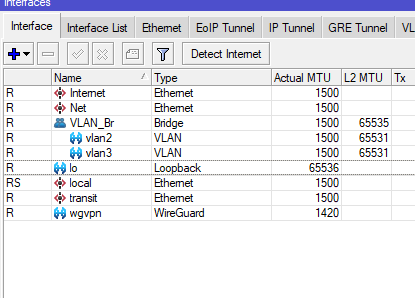

*Interface R1*

---

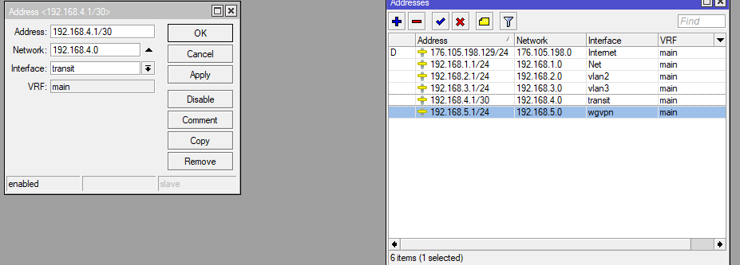

*Add an address to the transit interface to R2*

--- 

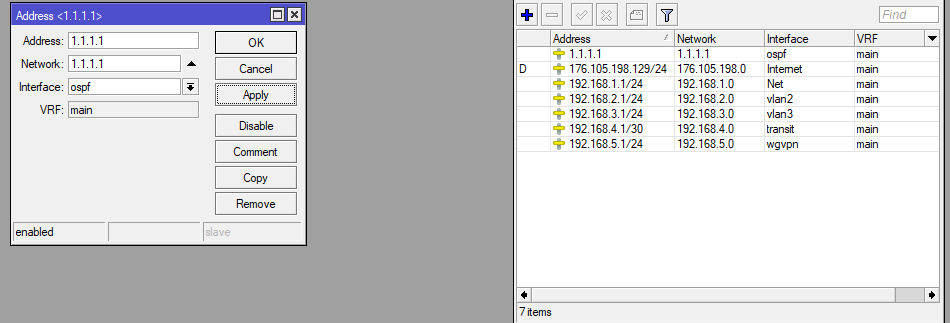

---

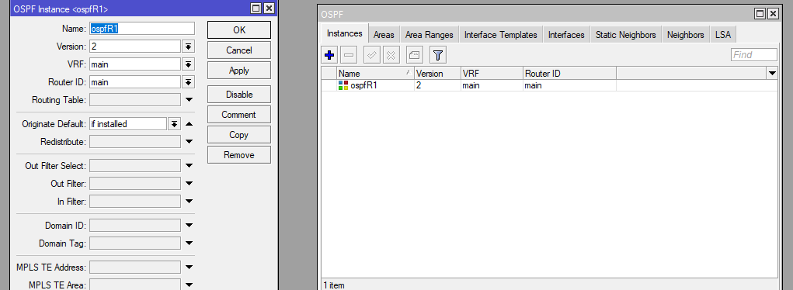

---

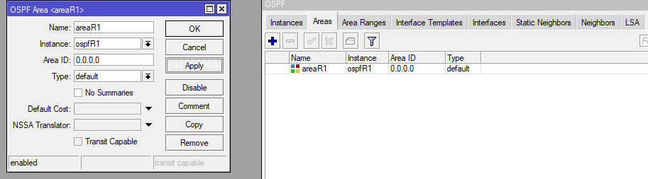

---

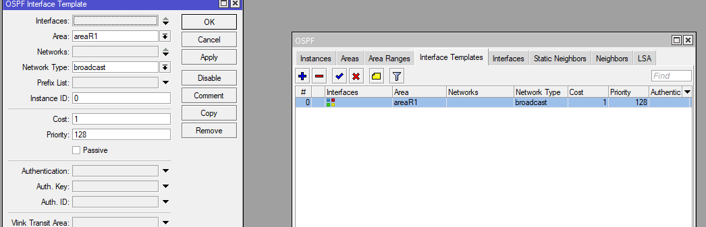

---

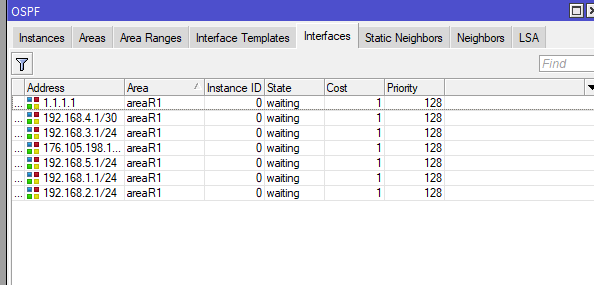

---

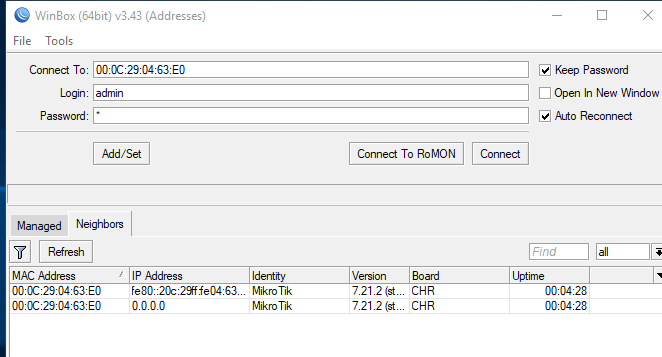

---

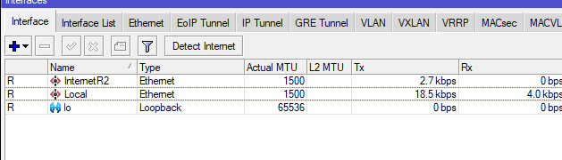

---

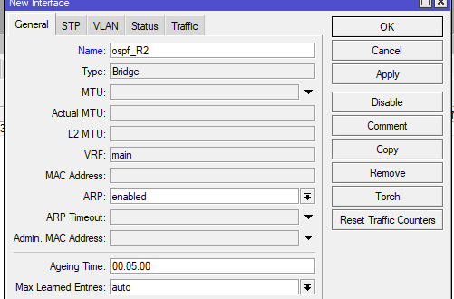

---

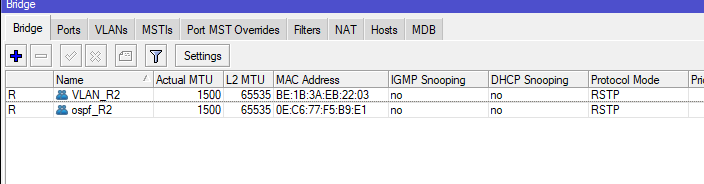

---

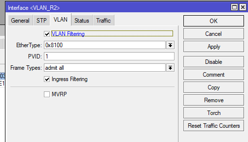

---

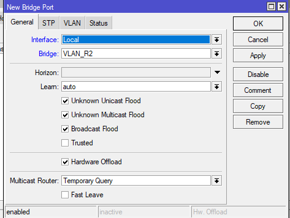

---

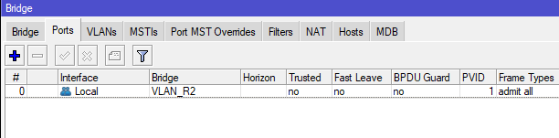

---

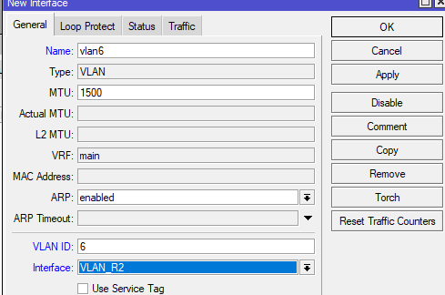

---

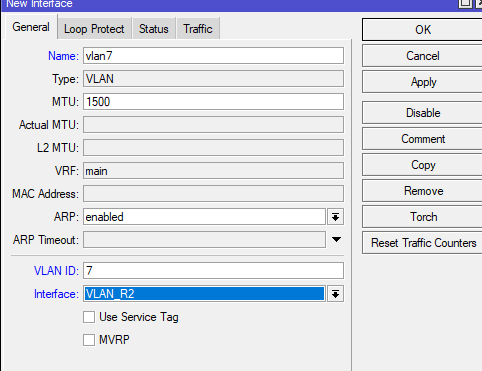

---

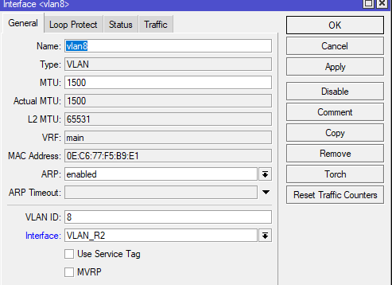

---

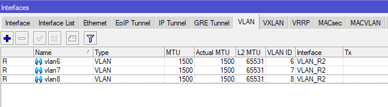

---

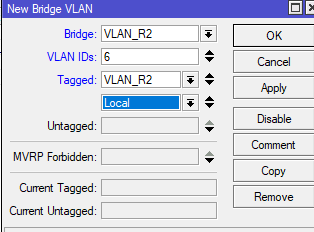

---

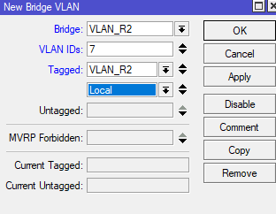

---

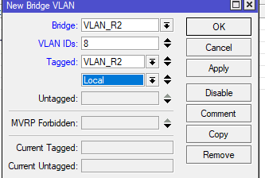

---

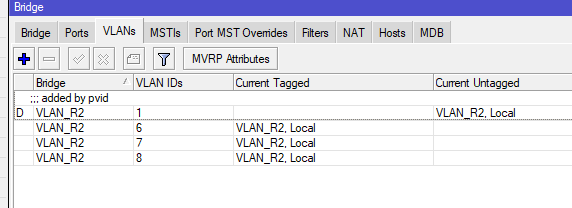

---

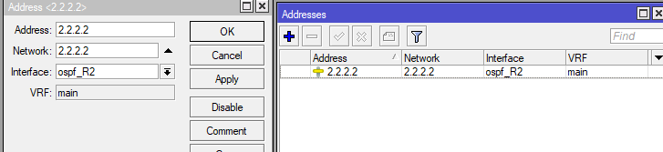

---

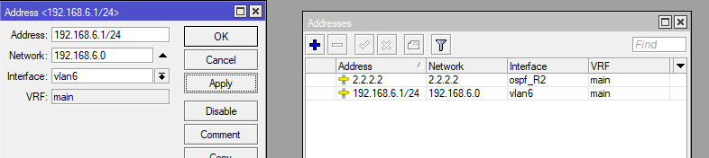

---

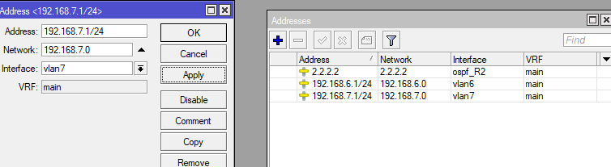

---

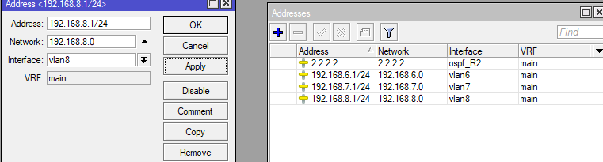

---

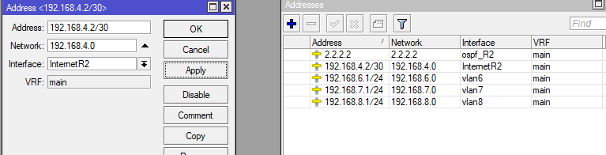

---

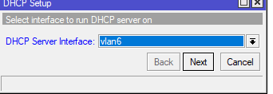

---

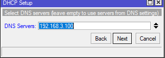

---

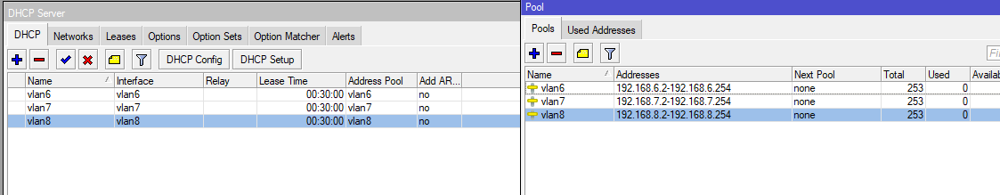

---

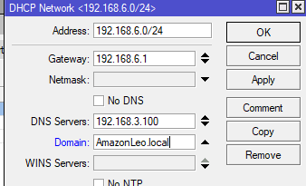

---

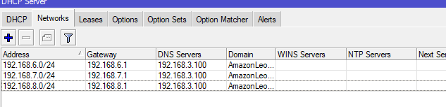

---

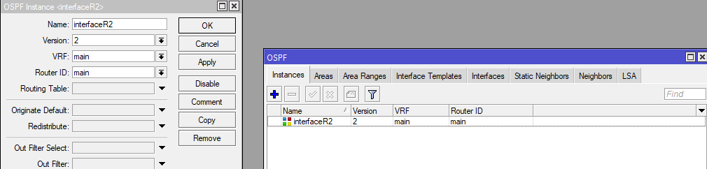

---

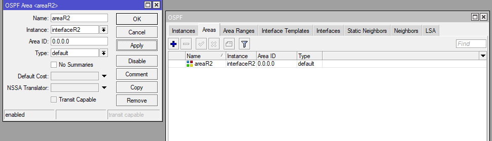

---

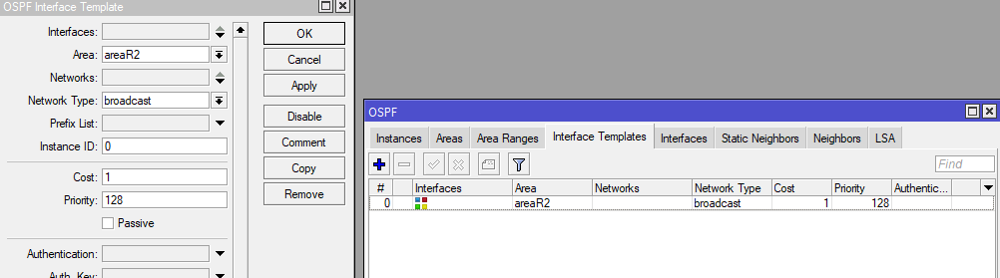

---

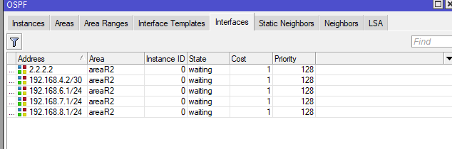

---

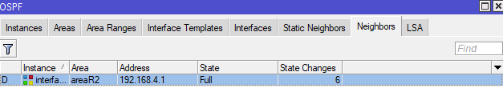

---

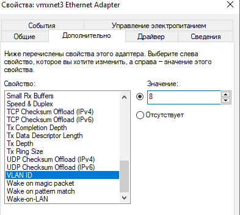

---

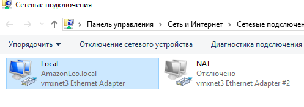

---

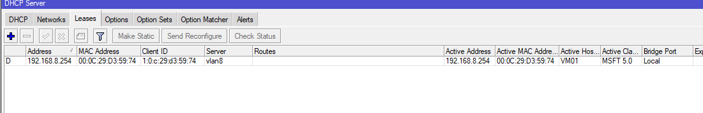

---

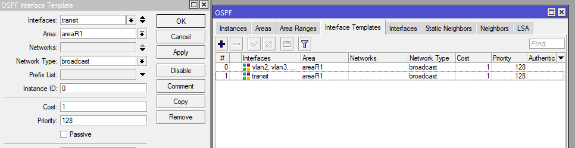

---

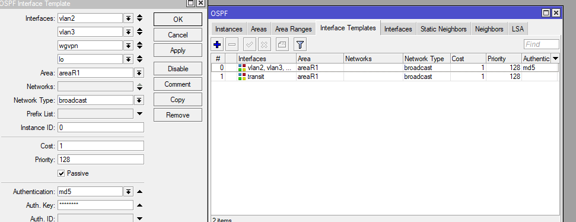

---

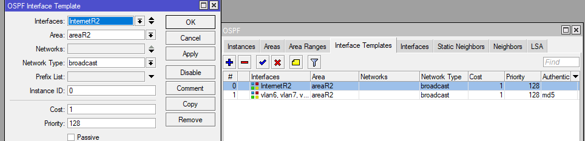

---

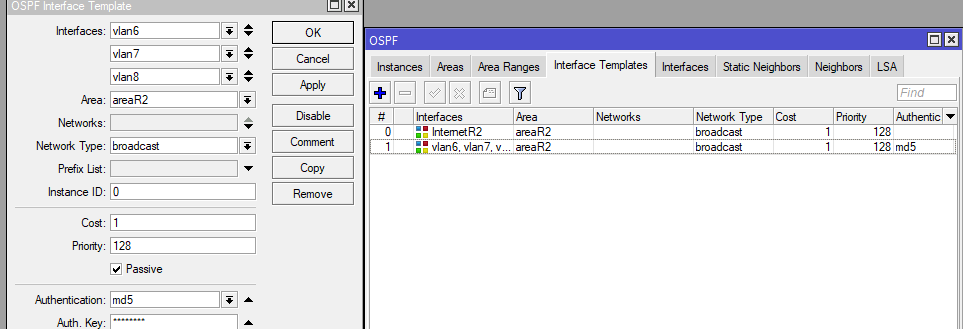

---

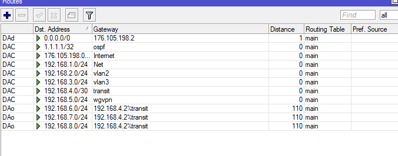

---

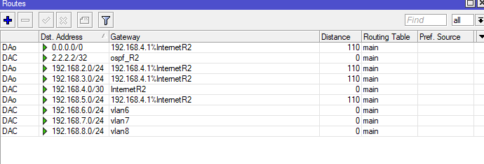

---

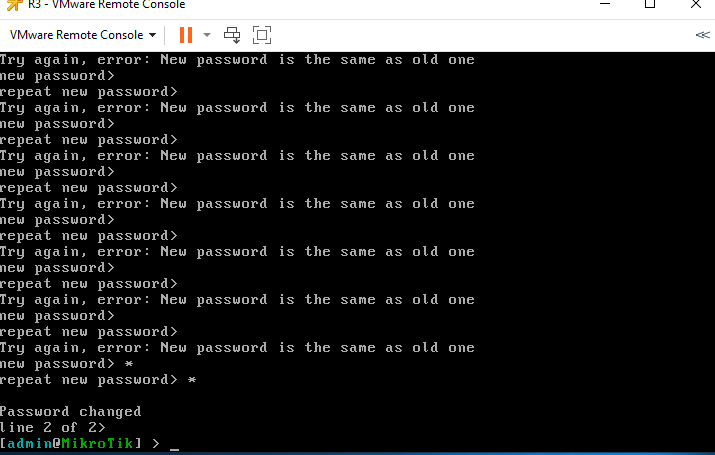

---

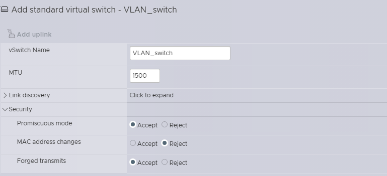

---

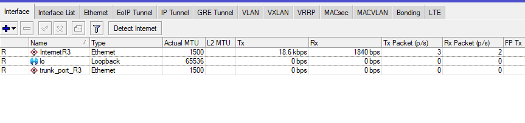

---

---

---

---

---

---

---

---

---

---

---

---

---

---

---

---

---

### 2. Centralized Access Control (NPS / RADIUS)
* The **NPS (Network Policy Server)** role has been deployed on Windows Server.
* MikroTik routers have been added as RADIUS clients.
* Network policies have been created to authorize router administrators via the `AMAZONLEO\routeradmin` domain group.
* **Vendor-Specific Attributes (VSA)** transfer from the RADIUS server to MikroTik (Vendor ID: `14988`, Attribute 3: `full`) has been configured to automatically assign `full` access rights to domain users when logging in via WinBox.

📸 Click here to view step-by-step configuration screenshots

  

---

---

---

---

---

---

---

---

---

---

---

---

---

---

---

---

---

---

---

### 3. VPN & Remote Access
* **WireGuard VPN:** Configured tunneling on R1 with automatic key generation and configuration files for clients (`vm51.conf` config generated).
* **L2TP/IPSec VPN:** Configured L2TP server on R1/R2 with mandatory IPSec encryption (Required). Authentication integrated with domain RADIUS.
* **CMAK (Connection Manager Administration Kit):** Created a connection installation profile for Windows clients that automatically configures security settings, DNS suffix (`AmazonLeo.local`) and runs a routing script (`st_99.bat`) upon successful connection.

📸 Click here to view step-by-step configuration screenshots

  

---

---

---

---

---

---

---

---

---

---

---

---

---

---

---

---

---

---

---

---

---

---

---

---

---

---

---

---

---

---

---

---

---

---

---

---

---

---

### 4. Domain Services and Hypervisor Integration
* DNS server configured with forward and reverse zones (PTR records created for KMS and DC1).
* **VMware ESXi** hypervisor successfully entered into the `AMAZONLEO.LOCAL` domain.
* ESXi administration rights delegated to the `AMAZONLEO\routeradmin` domain group (Authentication Services -> Active Directory Enabled).

📸 Click here to view step-by-step configuration screenshots

  

---

---

---

---

---

---

---

---

---

---

### 5. Licensing Infrastructure (KMS Host)
* A local **KMS** activation node has been deployed on a dedicated server in the subnet.
* An SRV record `_vlmcs._tcp` on port `1688` has been created in DNS for automatic search of the activation server by clients.
* A successful activation of the Windows 10 client VM using the local KMS host (validated via `slmgr /dlv`) has been performed.

📸 Click here to view step-by-step configuration screenshots

  

---

---

---

---

---

---

---

---

---

---

---

---

---

